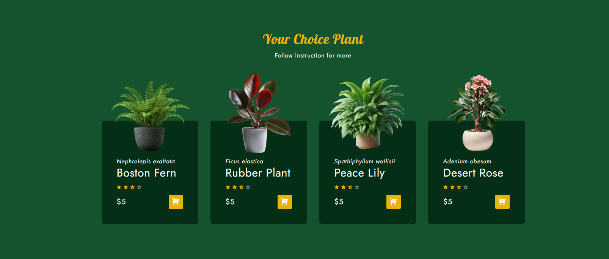
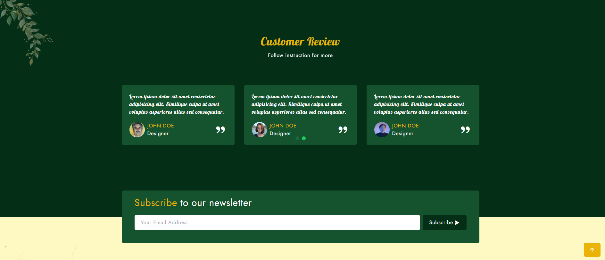

# Tailwind CSS Practice Project





A simple website built to practice and demonstrate Tailwind CSS capabilities.

## About

This project is a basic implementation focusing on learning and experimenting with Tailwind CSS utility classes and responsive design principles.

## Technologies Used

- HTML
- Tailwind CSS
- JavaScript (minimal)

## Getting Started

1. Clone the repository
2. Install dependencies with `npm install`
3. Start the Tailwind watcher with:
   ```bash
   npm run watch
   ```

  4. To deploy the project, run:
    ```bash
    npm run deploy
    ```

## Acknowledgements

Thanks to [this tutorial](https://youtu.be/zKguO4oaAGs?si=yYWlmPdjXGRltrIK) for guidance.